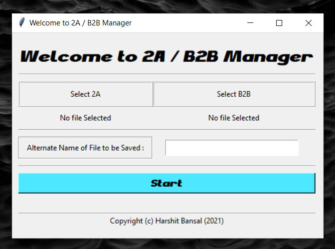
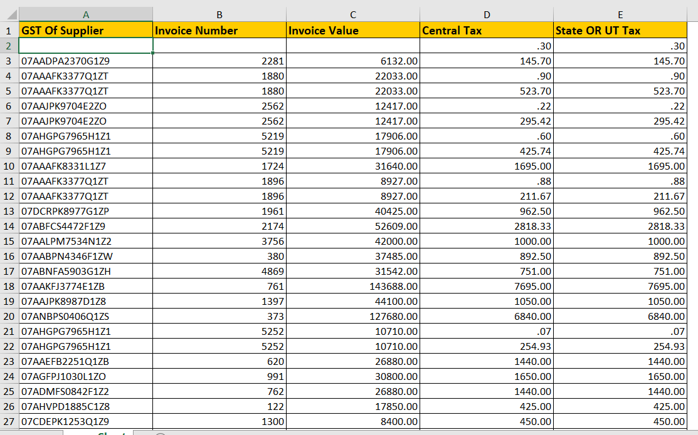
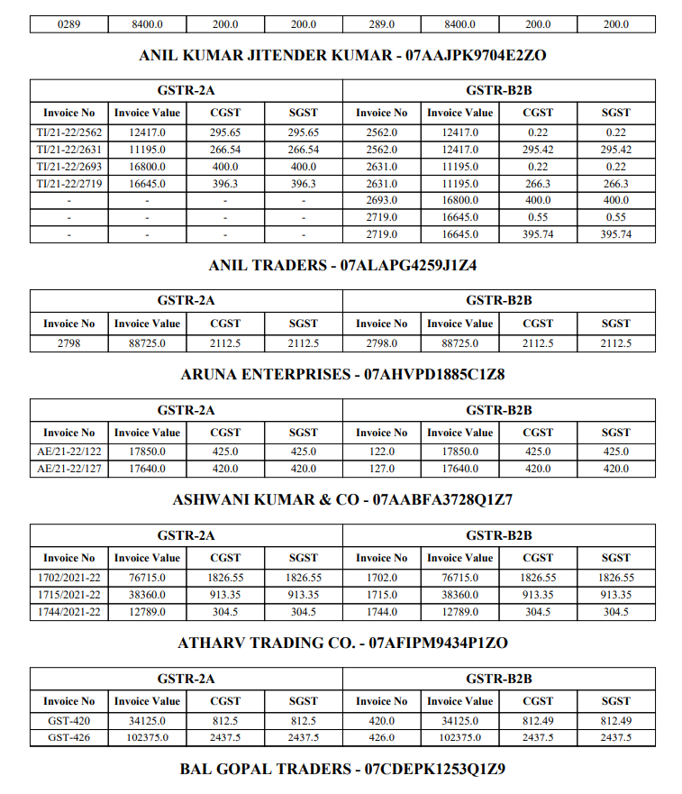

# Documentation
## GST 2A - B2B Manager
Script with GUI for Altering 2 Excel Files (2A & B2B GST Filing Reports) into 1 PDF File so that it would help the reader to compare both files.
* [Inspiration and Need](#inspiration-and-need)
* [Example](#example)
### Inspiration and Need
My Father owns a business. 
So at the end of every financial quarter he had to compare these both files on pen and paper. 
So I made this Simple Python Script which can alter these both files into one PDF file which is so much easier to compare.

  

### Example
There are 2 Files Named:
* *GSTR - 2A .xlx* :

* 

  
  

* *GSTR - B2B .xlx* :

* 

  

* After Using The Script. A PDF File is Generated :

  

